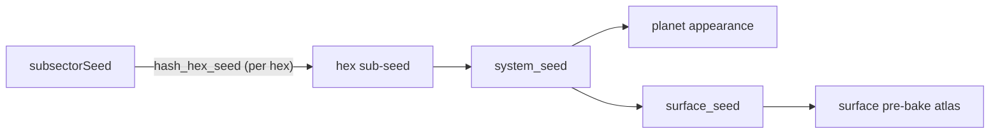
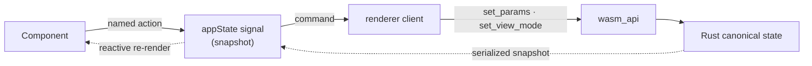

# UWP Architecture

How UWP is put together: a WebGPU + Rust/WASM + Preact PWA that generates
Cepheus-style star sectors and renders their worlds. This document covers the
system shape, the layer boundaries, and the main data flows. Operating guidance
(verification, deployment policy, product intent) lives in
[`../AGENTS.md`](../AGENTS.md); the sequential work list lives in
[`BACKLOG.md`](./BACKLOG.md).

## High-level shape

UWP is a **client-only PWA**. There is no backend: every sector, system, world,
and surface is generated deterministically from a seed, in the browser. The work
splits along one firm line:

- **Rust owns deterministic simulation and expensive derived data** — system
  generation, climate, the surface pre-bake, subsector/sector generation, and
  all GPU rendering.
- **TypeScript owns the UI, app state, interaction flow, and the lightweight SVG
  maps** — and treats the Rust side as a typed facade it sends commands to and
  reads snapshots from.


> Source: [`diagrams/system-overview.dot`](diagrams/system-overview.dot).
> Regenerate with `npm run diagrams` (needs Graphviz). See
> [`diagrams/README.md`](diagrams/README.md) for the diagram convention.

A second Rust/WASM instance runs inside a **Web Worker**
(`src/wasmComputeWorker.ts`) so full-sector generation (1,280 systems) happens
off the main thread.

## Stack

- **Rendering:** WebGPU via `wgpu` (backend `BROWSER_WEBGPU`), WGSL shaders.
- **Compute + render core:** Rust compiled to WASM with `wasm-pack`
  (`crates/planet-render`), exposed through `wasm-bindgen`.
- **UI:** Preact + `@preact/signals` for *all* state (shared and local UI flags).
- **Build/dev:** Vite + TypeScript, `vite-plugin-wasm`, `vite-plugin-pwa`
  (offline service worker), `vite-plugin-top-level-await`.
- **Quality gates:** Vitest (TS), `cargo test` + `clippy` (Rust), Playwright
  (e2e smoke), Husky hooks. See `AGENTS.md` › Verification.
- **Deploy:** GitHub Actions → Cloudflare (`wrangler`) at `uwp.tre.systems`.

## Repository layout

```
crates/planet-render/src/
  domain/        pure, testable simulation (no GPU):
                 system.rs        SolarSystem / Star / Planet / Moon / belts
                 climate.rs       per-planet ClimateSummary (energy balance)
                 stability.rs     long-timescale orbital stability checks
                 blackbody.rs     star colour from temperature (CIE)
                 surface_prebake.rs   1024×512 lat/lon height atlas (plates+noise)
                 surface_atlas.rs     icosahedral surface cells (stable ids)
                 surface_map.rs       hex surface map (terrain/cities/starport)
                 subsector.rs     Subsector/SubsectorHex/Uwp/Bases/JumpRoute,
                                  generate() / generate_sector(), polity cells,
                                  routes, projection to UWP digits
  scenes/        detail.rs        detail-view uniforms, mesh res, scene targets
                 system.rs        system-overview (orrery) uniforms + picking
  gpu.rs         device/surface/pipeline creation
  renderer.rs    frame state, param diffing, render-pass orchestration
  wasm_api.rs    the wasm-bindgen surface (the only JS-visible Rust API)
  shaders/       planet.wgsl atmosphere.wgsl system.wgsl background.wgsl
                 common.wgsl  chunks/agx.wgsl

src/
  domain/        TS DTOs mirroring serialized Rust + game logic:
                 system/      SolarSystem/Planet/... interfaces
                 cepheus/     UWP parsing, trade codes, zones, bases
                 mainWorld/   continuous ↔ UWP projection
                 subsector/   Subsector DTOs, import.ts, export.ts, types.ts
                 surfaceMap/  SurfaceMap DTOs
                 names.ts     deterministic pronounceable names
  appState/      signals, named actions, urlState.ts (hash <-> state)
  rendererClient/  typed facade over the WASM renderer + frame loop
  components/     Canvas, SubsectorMap, SurfaceMap, editors, Performance, ...
  renderProfile.ts   adaptive quality tiers (ULTRA…MINIMUM)
  gpuProbe.ts        WebGPU adapter-capability probe (gates ULTRA)
  uwpVisualMapping.ts / systemVisualMapping.ts   UWP/body -> renderer params
  wasmCompute.ts / wasmComputeWorker.ts / subsectorClient.ts   worker bridge
```

## The layers, in detail

### 1. Domain (Rust) — `crates/planet-render/src/domain`

Pure, deterministic, GPU-free, and unit-tested. Given a seed it produces a
`SolarSystem` (stars, planets, moons, belts), a per-planet `ClimateSummary`, a
`Subsector` (the 8×10 or 32×40 hex grid with UWPs, bases, zones, polities, and
jump routes), a surface height **pre-bake**, and the icosahedral **surface
atlas**. Everything serializes (serde) to JSON for the TS side. This layer does
not depend on the renderer; the renderer depends on it.

### 2. Domain (TS) — `src/domain`

TypeScript interfaces that *mirror* the serialized Rust structs (field names must
match), plus the game-facing logic that is cheaper/clearer in TS: UWP
parsing/formatting (`cepheus/`, `uwp.ts`), trade-code derivation, the
continuous↔UWP projection (`mainWorld/`), and the sector **import/export**
(`subsector/import.ts`, `export.ts` — T5SS tab + classic `.sec`, see
[`sector-data-format.md`](./sector-data-format.md)).

### 3. App state — `src/appState`

`@preact/signals` are the single source of UI truth. Components call **named
actions** (`selectHex`, `setSystemSeed`, `focusSystemTarget`,
`setRenderQualityMode`, …); they never poke the WASM object or `window` directly.
`urlState.ts` keeps the location hash (`sub` / `sys` / `body` / `hex` / `view` /
overrides) in sync both ways, which is what makes any view a shareable deep link.
The `params` signal is a *snapshot* of the renderer's world params — writes go
through actions and are forwarded to the renderer client.

### 4. Renderer client — `src/rendererClient`

A typed facade owning the WASM renderer's lifecycle: device/canvas init, the
`requestAnimationFrame` loop, resize handling, render-profile selection +
application, system/surface snapshot refresh, and command forwarding
(`setParams`, `setViewMode`, `setSystemSeed`, `rerollPlanet`). It also runs the
**render-on-demand** throttle (idle frames are cheap) and the **frame-time
downshifter** (drops the quality tier if frames run slow). Product UI talks to
this through actions, not to `window.uwp` (which stays a debug handle).

### 5. Render backend (Rust) — `gpu.rs`, `renderer.rs`, `scenes/`

`gpu.rs` builds the device, surface, and pipelines. `renderer.rs` holds frame
state, diffs incoming params against the last frame (so only changed work
re-runs — e.g. terrain only re-bakes when seed/water change), and orchestrates
the render passes. `scenes/detail.rs` and `scenes/system.rs` own each view's
uniform packing, camera fitting, and (for system view) ray-pick. Rust **unit
tests pin the uniform struct layouts** so they can't silently drift from the
WGSL.

### 6. Shaders (WGSL) — `shaders/`

`planet.wgsl` renders a body by `body_visual_mode`: terrain planet, gas/ice
giant (fluid submodes), star (`stellar_surface`), or asteroid. `atmosphere.wgsl`
is the fullscreen composite pass — scattering, bloom, and the AGX tonemap
(`chunks/agx.wgsl`). `system.wgsl` is the orrery scene. `common.wgsl` holds the
shared `Uniforms` struct and noise/helpers. WGSL chunks compose through
`shader_with_common`.

## Patterns

The codebase is built from a small set of recurring patterns. New code should
follow them — they are what keep the Rust / JS / GPU split coherent.

- **Signals as the single source of UI state.** `@preact/signals` holds all
  state, shared *and* local UI flags. Components read signals and re-render
  reactively; there is no separate store.
- **Action / command boundary.** Components call named actions in `appState`
  (`selectHex`, `setSystemSeed`, `focusSystemTarget`, …). They do not mutate
  shared state inline or touch the WASM object / `window.uwp`. *(Holds in
  practice: no `window.uwp` references in `src/components`.)*
- **Typed facade over WASM.** `rendererClient` is the only code that talks to the
  WASM `Planet` object — it owns lifecycle, the frame loop, resize, render
  profiles, snapshots, and commands. The rest of the app sees typed methods.
- **State ownership — Rust canonical, JS snapshot + command.** Rust holds the live
  renderer state (`PlanetParams`, `SolarSystem`, camera, GPU resources); JS reads
  *snapshots* and issues *commands*. The `params` signal is a snapshot, not a
  mutable source of truth.
- **DTO mirroring.** TS interfaces mirror the serialized Rust structs field-for-
  field (serde round-trip); serialized data is never typed `any`. *(Holds: no
  `any` / `as any` on serialized data in product code.)*
- **Projection at the boundary.** Internals are continuous physical/social values;
  they round to discrete UWP codes only at the game-facing boundary
  (`domain/mainWorld`, `uwpVisualMapping`). UWP is a readable label, not the
  source of truth.
- **Deterministic seed derivation.** Pure chains — `subsectorSeed` → per-hex
  sub-seed (`hash_hex_seed`) → `system_seed` → planet appearance + `surface_seed`.
  The same seed always paints the same sector, system, and world. This is what
  makes share links stable, overrides expressible as seed-keyed deltas, and the
  generation paths testable without a GPU.
- **Override-as-delta.** Referee edits are stored as deltas keyed by seed +
  generated endpoint ids, then applied as a TS overlay over freshly generated
  Rust data — so generated data stays resettable and regeneration-safe.
- **Off-thread compute.** Heavy generation (a full 32×40 sector = 1,280 systems)
  runs in a Web Worker (`wasmComputeWorker`), keeping the UI responsive.
- **Lazy + cached derived data.** Expensive derived data caches its key and only
  recomputes when the key changes: the surface pre-bake caches `(seed, water)`;
  the renderer diffs incoming params and re-runs only changed fields; hidden
  Surface views don't regenerate on every control move.
- **Adaptive quality — probe → profile → fail-closed.** Detect capability
  (`gpuProbe`), pick a tier (`renderProfile`), and drop back if frames run slow
  (the frame-time downshifter). Render-on-demand throttles idle frames.
- **URL as state.** The location hash encodes the full navigation state and the
  app restores it on load — every view is a shareable deep link.
- **One source of truth for derived values.** Derived data is computed once
  through one function (hex names via `resolveHexName`, trade codes via
  `deriveTradeCodes`), never re-derived differently per call site.

### Patterns to adopt (not yet applied)

- **Narrow typed setters at the WASM boundary.** A whole `PlanetParams` blob still
  crosses `set_params`, so JS keeps a writable canonical copy. The target is
  per-field setters Rust validates — the last state-ownership leak.
- **Generated Rust↔TS bindings.** DTOs are hand-mirrored, which can drift; codegen
  from the Rust structs would make the mirror automatic.
- **Golden-image / visual-regression testing.** The renderer has no automated
  visual snapshot guard, so shader changes can regress silently (`BACKLOG.md`
  task 8).

## Key data flows

Every flow below rests on one deterministic seed chain — same seed in, same
sector/system/world out:



**Sector generation.** A `subsectorSeed` change → `subsectorClient.ts` asks the
**worker** to `generate_sector(seed, density)` → Rust walks the 32×40 grid,
hashing a per-hex sub-seed and running `system::generate` per occupied hex (main
world eager, full planet/moon generation deferred) → a serialized `Subsector`
comes back → `setSubsector` → `SubsectorMap.tsx` draws SVG (no GPU), with LOD +
viewport culling so 1,280 hexes stay light.

**Hex → system → world → render.** `selectHex(coord)` applies the hex's UWP
params, sets the system seed, and switches to System view. The renderer client
generates that `SolarSystem`, and the detail view renders its main world (or any
body focused from the orrery / table). `systemVisualMapping.ts` /
`uwpVisualMapping.ts` translate a UWP or body into the `params` the shaders read.

**Surface.** The Rust `surface_prebake` (plate tectonics + multi-octave noise) is
uploaded once as a GPU height atlas; `planet.wgsl` samples it for the globe, and
`surface_atlas` drives the SVG Surface hex map — so the globe and the hex map
agree on coastlines. Generation is lazy + cached (hidden Surface views don't
re-bake on every slider move).

**Import/export.** Pasted T5SS/`.sec` text → `parseSectorData` → a `Subsector`
(synthesizing allegiances + per-world system seeds) → straight into the same
render path. Export reverses it (`subsectorToText`), round-trip tested.

## The Rust ↔ JS ↔ GPU boundary

`wasm_api.rs` is the *only* JS-visible Rust API. State ownership is deliberately
asymmetric: **Rust holds the canonical renderer state; JS holds snapshots and
issues commands.** Today one whole-`PlanetParams` setter (`set_params`) still
crosses the boundary as a blob, which is the last place JS keeps a writable
canonical copy — the planned move is narrow typed setters once enough Rust-side
invariants justify per-field validation (tracked in `AGENTS.md`).



## Rendering pipeline & adaptive quality

> Every photoreal technique and its paper reference lives in
> [RENDERING.md](RENDERING.md).

Detail view renders to an **offscreen `Rgba16Float` scene target** (HDR): a
background pass, then the planet mesh (a cubesphere whose resolution follows
`meshQuality`), then `atmosphere.wgsl` composites scattering + bloom and tonemaps
to the swapchain.

Quality is picked per device by `renderProfile.ts`:

| Tier | Used for |
| --- | --- |
| **ULTRA** | capable desktop GPUs — supersamples ~1.75× device pixels + finer atmosphere raymarch |
| **HIGH** | desktop default |
| **BALANCED / LOW** | mid / weak devices, tablets |
| **MINIMUM** | phones — fixed-res mesh, smallest pixel budget |

`detectRenderProfile` chooses an initial tier from browser hints; after init,
`gpuProbe.ts` reads the WebGPU adapter's limits and, on capable hardware,
`upgradeForCapableGpu` lifts a desktop HIGH session to ULTRA. The **frame-time
downshifter** drops the tier if frames run slow, so every upgrade fails closed.

## Deployment

Push to `main` → GitHub Actions runs the full gate (TS + Rust tests, clippy,
build, Playwright) and a separate job deploys the verified artifact to Cloudflare
via `wrangler`. The build ID is stamped from the commit SHA. **Never deploy from
a dev/agent machine** — see `AGENTS.md` › Deployment Policy.

## What this architecture deliberately does *not* include

- **No backend / no hosted persistence (yet).** State lives in the URL hash and
  `localStorage`. The online-play work (`BACKLOG.md` task 11) adds a campaign
  model designed to move to hosted storage *without* reworking generation.
- **No WebGL / canvas2D fallback for the planet.** WebGPU is required; absence
  shows an explicit unsupported card, not a degraded renderer.
- **No Rust UI framework.** Preact owns the DOM; Rust owns simulation + GPU. The
  Rust↔JS bridge is interaction-time, never per-frame-hot, so it isn't a
  bottleneck worth optimising away.
- **One WebGPU canvas.** Subsector and Surface hex maps are SVG siblings of the
  canvas, not separate GPU contexts.
- **No fork of Cepheus rules.** The game-facing projection has one domain home
  (`domain/cepheus` + `domain/mainWorld`) with tests, not copies scattered across
  the UI.
